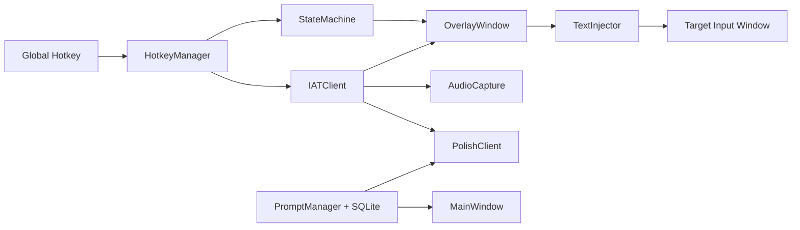

# InnerVoice


InnerVoice 是一个面向 Windows 桌面的语音输入应用。它把“长按热键说话、实时看到转写、在悬浮窗确认结果、再把文本回填到目标输入框”这条链路真正做成了可运行的桌面体验，而不只是单独的语音识别 Demo。

项目当前基于 `PySide6 + Python` 构建，接入讯飞 IAT 进行流式语音识别，并结合 DeepSeek 提供文本润色能力。对用户来说，它更像一个轻量、克制、随时可唤起的桌面语音输入助手；对开发者来说，它提供了一套边界清晰的基础工程，适合继续扩展语音输入、文本优化和桌面交互能力。

<iframe src="//player.bilibili.com/player.html?isOutside=true&aid=116635692177543&bvid=BV1FqGo6tEFP&cid=38608701998&p=1" scrolling="no" border="0" frameborder="no" framespacing="0" allowfullscreen="true"></iframe>

## 核心功能

### 语音输入闭环

- 全局热键触发语音输入，默认使用 `Right Ctrl`
- 长按触发录音，松开后自动结束录音并等待最终识别结果
- 基于讯飞 IAT WebSocket 的流式语音识别
- 悬浮窗实时展示中间转写结果与当前状态
- 识别完成后进入预览态，支持确认或取消
- Enter 确认注入， Esc 取消

### 文本润色能力

- 识别完成后可自动调用 DeepSeek 对文本进行润色
- 内置 `正式`、`日常`、`简洁` 三种预设风格
- 支持在主窗口中新增、编辑、删除自定义润色风格
- 支持设置默认风格，并在悬浮窗中切换不同风格查看结果
- 当润色密钥未配置时，仍可直接使用原始识别文本

## 核心体验

默认交互流程如下：

```text
长按 Right Ctrl
  -> 达到长按阈值后开始录音
  -> 建立讯飞 IAT WebSocket 连接
  -> 流式发送麦克风音频
  -> 悬浮窗实时显示中间转写结果
松开 Right Ctrl
  -> 停止录音并发送结束帧
  -> 等待最终识别结果
  -> 进入预览态并自动触发默认润色风格
确认结果
  -> 恢复目标窗口焦点
  -> 文本注入到光标位置
取消结果
  -> 结束当前流程并返回空闲状态
```

## 项目架构



### 关键模块说明

- `HotkeyManager`：监听全局热键，控制长按开始、松开结束、确认与取消
- `StateMachine`：统一管理 `IDLE / LISTENING / PROCESSING / PREVIEW / ERROR` 五个状态
- `AudioCapture`：采集麦克风 PCM 音频数据
- `IATClient`：连接讯飞 IAT WebSocket，处理中间结果与最终结果
- `OverlayWindow`：底部悬浮窗，负责状态展示、文本预览、风格切换和确认取消按钮
- `TextInjector`：记录目标窗口、恢复焦点、注入文本并尽量恢复原剪贴板
- `PolishClient`：异步调用 LLM 进行文本润色
- `PromptManager`：通过 SQLite 管理润色风格的增删改查和默认风格
- `MainWindow`：提供润色风格管理界面和系统托盘入口

## 技术栈

| 层级         | 技术                      | 说明                               |
| ------------ | ------------------------- | ---------------------------------- |
| 桌面 UI      | PySide6                   | 主窗口、悬浮窗、托盘、状态反馈     |
| 全局热键     | keyboard                  | 监听 `Right Ctrl`、`Enter`、`Esc`  |
| 音频采集     | PyAudio                   | 采集麦克风音频流                   |
| 语音识别     | iFlytek IAT WebSocket     | 流式中文语音转写                   |
| 文本润色     | OpenAI SDK + DeepSeek API | 异步文本润色                       |
| 数据存储     | SQLite                    | 存储润色风格配置                   |
| Windows 能力 | pywin32                   | 前台窗口获取、窗口激活、剪贴板操作 |
| 测试         | pytest                    | 核心模块单元测试                   |

## 快速开始

### 环境要求

- Windows 10 / 11
- 可用麦克风设备
- 讯飞 IAT API Key
- DeepSeek API Key（可选，仅润色功能需要）

### 安装依赖

建议直接使用项目要求的 Conda 环境 Python：

```bash
pip install -r requirements.txt
```

### 启动应用

```bash
python src\app\main.py
```

启动后：

- 主窗口会显示润色风格管理页面
- 应用会常驻系统托盘
- 长按 `Right Ctrl` 即可开始语音输入

## 密钥配置

项目配置文件位于 [configs](/D:/LearnPython/InnerVoice/configs) 目录，加载顺序如下：

```text
DEFAULTS
-> configs/default_settings.json
-> configs/settings.json
-> configs/settings.local.json
```

推荐把本机私有密钥写入 [configs/settings.local.json](/D:/LearnPython/InnerVoice/configs/settings.local.json)。该文件匹配 `*.local.json`，已被 `.gitignore` 忽略。

配置示例：

```json
{
  "asr": {
    "appid": "your-xfyun-appid",
    "apikey": "your-xfyun-apikey",
    "apisecret": "your-xfyun-apisecret",
    "language": "zh_cn",
    "accent": "mandarin"
  },
  "polish": {
    "api_key": "your-deepseek-api-key",
    "base_url": "https://api.deepseek.com",
    "model": "deepseek-chat"
  }
}
```

### 配置项说明

| Key                                               | 说明                                  |
| ------------------------------------------------- | ------------------------------------- |
| `hotkey`                                          | 触发语音输入的热键，默认 `right ctrl` |
| `long_press_threshold_ms`                         | 长按阈值，默认 `300` 毫秒             |
| `panel_width` / `panel_height` / `panel_offset_y` | 悬浮窗尺寸与位置参数                  |
| `asr.appid` / `asr.apikey` / `asr.apisecret`      | 讯飞 IAT 语音识别凭据                 |
| `asr.language` / `asr.accent`                     | 识别语言与口音参数                    |
| `polish.api_key`                                  | DeepSeek 润色 API Key                 |
| `polish.base_url` / `polish.model`                | 润色接口地址与模型名                  |

## 项目结构

```text
InnerVoice/
├─ assets/                     # 图标等静态资源
├─ configs/                    # 默认配置、共享配置与本地覆盖配置
├─ data/                       # SQLite 数据文件目录
├─ docs/                       # 设计与计划文档
├─ src/
│  ├─ app/                     # 应用入口与启动编排
│  ├─ core/config/             # 配置加载与深度合并
│  ├─ db/                      # SQLite 初始化与连接管理
│  ├─ modules/
│  │  ├─ asr/                  # 音频采集与讯飞 IAT 客户端
│  │  ├─ hotkey/               # 全局热键管理
│  │  ├─ injector/             # 文本注入与焦点恢复
│  │  ├─ overlay/              # 悬浮窗、状态机、状态指示
│  │  └─ polish/               # 润色客户端与风格管理
│  ├─ shared/types/            # 共享类型与状态枚举
│  └─ ui/                      # 主窗口与风格管理页面
├─ tests/unit/                 # 单元测试
├─ requirements.txt
└─ README.md
```

## 使用说明

### 语音输入

1. 启动应用后保持其在后台运行
2. 将光标放到任意可输入文本的位置
3. 长按 `Right Ctrl`，达到阈值后开始录音
4. 对着麦克风说话，悬浮窗会实时显示转写内容
5. 松开 `Right Ctrl`，系统停止录音并等待最终识别结果
6. 如果已配置润色密钥，系统会自动按默认风格进行润色
7. 在预览态按 `Enter` 或点击“确认”即可注入文本
8. 按 `Esc` 或点击“取消”即可放弃本次输入

### 润色风格管理

主窗口提供独立的润色风格管理页，支持：

- 查看当前所有预设风格与自定义风格
- 新增自定义风格名称与提示词
- 编辑已有风格
- 设置默认风格
- 删除非预设风格

预设风格包括：

- `正式`
- `日常`
- `简洁`

## 测试与开发说明

### 运行测试

```bash
cd D:\LearnPython\InnerVoice
D:\anaconda3\envs\any\python.exe -m pytest tests\unit -q
```

### 关键入口文件

- [src/app/main.py](/D:/LearnPython/InnerVoice/src/app/main.py)
- [src/core/config/settings.py](/D:/LearnPython/InnerVoice/src/core/config/settings.py)
- [src/modules/hotkey/hotkey_manager.py](/D:/LearnPython/InnerVoice/src/modules/hotkey/hotkey_manager.py)
- [src/modules/asr/iat_client.py](/D:/LearnPython/InnerVoice/src/modules/asr/iat_client.py)
- [src/modules/asr/audio_capture.py](/D:/LearnPython/InnerVoice/src/modules/asr/audio_capture.py)
- [src/modules/overlay/overlay_window.py](/D:/LearnPython/InnerVoice/src/modules/overlay/overlay_window.py)
- [src/modules/injector/text_injector.py](/D:/LearnPython/InnerVoice/src/modules/injector/text_injector.py)
- [src/modules/polish/polish_client.py](/D:/LearnPython/InnerVoice/src/modules/polish/polish_client.py)
- [src/modules/polish/prompt_manager.py](/D:/LearnPython/InnerVoice/src/modules/polish/prompt_manager.py)

## License

本项目采用 [MIT License](/D:/LearnPython/InnerVoice/LICENSE)。
