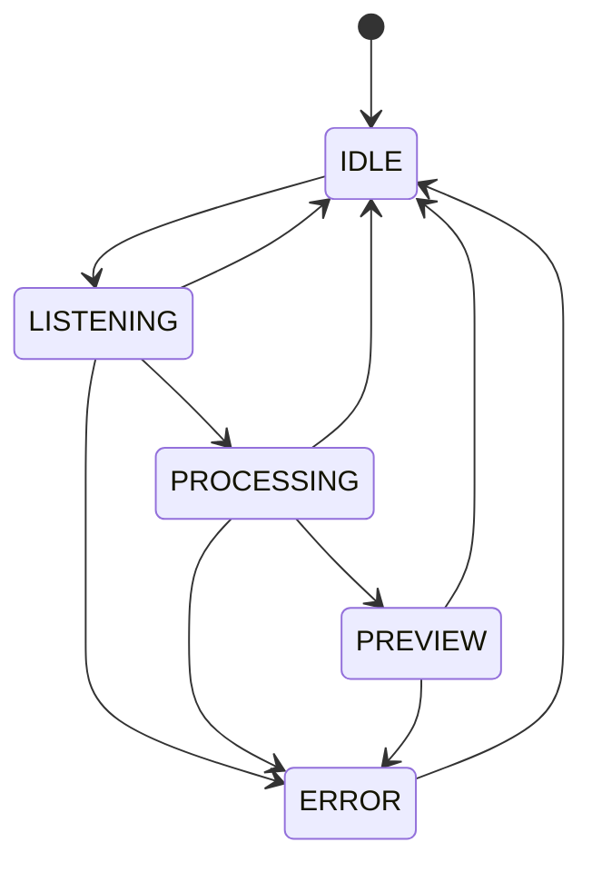

# InnerVoice


一个面向 Windows 桌面的轻量级语音输入原型。

`InnerVoice` 试图把“语音转写工具”再往前推一步：不是只把语音变成文本，而是打通完整输入闭环。长按全局热键开始说话，实时看到转写内容，确认后直接把文本注入你刚刚正在输入的应用里。

当前仓库是一个可运行、可演示、可继续迭代的 MVP，重点解决以下链路：

- 全局热键唤起
- 实时录音与流式转写
- 悬浮预览与状态反馈
- 跨应用文本注入

## Preview

### Demo GIF

把演示 GIF 放到 `docs/images/demo.gif` 后，这里会自动显示：

```md

```

当前占位：

> Demo GIF placeholder: `docs/images/demo.gif`

### Typical Flow

```text
Long press Right Ctrl
  -> start listening
  -> stream audio to iFlytek IAT
  -> show partial transcript
  -> release key to finish
  -> preview final text
  -> press Enter to inject
```

## Why This Project

桌面端的语音输入常见问题不是“不能识别”，而是“不能真正输入”：

- 只能在单个应用里用
- 识别结果出来后还得手动复制粘贴
- 没有明确状态反馈，容易误触或误注入

`InnerVoice` 的目标很直接：让语音输入像一个真正的系统级输入动作，而不是孤立的转写面板。

## Features

- 全局热键触发，默认长按 `Right Ctrl`
- 基于 `PyAudio` 的 16kHz 单声道麦克风采集
- 基于讯飞 IAT WebSocket 的流式语音识别
- 基于 `PySide6` 的悬浮状态面板
- 实时显示中间识别结果与最终结果
- 恢复目标窗口焦点后自动粘贴文本
- 明确的状态机设计，便于扩展与调试
- 已覆盖核心模块的单元测试

## Architecture


## State Flow



状态说明：

- `IDLE`: 空闲，面板隐藏
- `LISTENING`: 录音中，显示实时转写
- `PROCESSING`: 已停止录音，等待最终结果
- `PREVIEW`: 展示最终文本，支持确认或取消
- `ERROR`: 出错，显示关闭入口

## Project Structure

```text
InnerVoice/
├─ assets/                 # 图标、音效等静态资源
├─ configs/                # 默认配置、用户配置、本地覆盖配置
├─ docs/                   # 设计与计划文档
├─ scripts/                # 预留脚本目录
├─ src/
│  ├─ app/                 # 应用入口与启动编排
│  ├─ core/config/         # 配置加载与深度合并
│  ├─ modules/
│  │  ├─ asr/              # 录音采集、讯飞 IAT 客户端
│  │  ├─ hotkey/           # 全局热键管理
│  │  ├─ injector/         # 文本注入
│  │  └─ overlay/          # 悬浮窗、状态机、状态指示器
│  └─ shared/types/        # 共享枚举与类型
└─ tests/unit/             # 单元测试
```

## Tech Stack

- Python 3.10+
- PySide6
- PyAudio
- websocket-client
- keyboard
- pywin32
- pytest

## Quick Start

### 1. Clone

```bash
git clone https://github.com/GodvFocus/InnerVoice.git
cd InnerVoice
```

### 2. Create a virtual environment

```bash
python -m venv .venv
.venv\Scripts\activate
```

### 3. Install dependencies

现在可以直接使用仓库内的 `requirements.txt`：

```bash
pip install -r requirements.txt
```

如果 `PyAudio` 安装失败，通常是本地音频依赖或 Python 版本兼容问题。这个项目更适合在 Windows 原生 Python 环境中运行。

### 4. Configure ASR credentials

编辑 [`configs/settings.json`](/D:/LearnPython/InnerVoice/configs/settings.json) 或新建 `configs/settings.local.json`，填入讯飞 IAT 凭据：

```json
{
  "asr": {
    "appid": "your-appid",
    "apikey": "your-apikey",
    "apisecret": "your-apisecret"
  }
}
```

更推荐使用 `configs/settings.local.json`，因为 `.gitignore` 已忽略 `*.local.json`。

### 5. Run

```bash
python src/app/main.py
```

默认操作：

- 长按 `Right Ctrl`: 开始录音
- 松开 `Right Ctrl`: 结束录音并等待最终结果
- `Enter`: 确认注入
- `Esc`: 取消当前流程

## Configuration

配置合并顺序：

```text
DEFAULTS
-> configs/default_settings.json
-> configs/settings.json
-> configs/settings.local.json
```

当前默认配置定义在 [`src/core/config/settings.py`](/D:/LearnPython/InnerVoice/src/core/config/settings.py)。

| Key | Default | Status |
| --- | --- | --- |
| `hotkey` | `right ctrl` | 已接入 |
| `long_press_threshold_ms` | `300` | 已接入 |
| `panel_width` | `480` | 已预留，尚未完全接入 UI |
| `panel_height` | `42` | 已预留，尚未完全接入 UI |
| `panel_offset_y` | `60` | 已预留，尚未完全接入 UI |
| `font_size` | `13` | 已预留 |
| `idle_timeout_seconds` | `30` | 已预留 |
| `asr.appid` | `""` | 已接入 |
| `asr.apikey` | `""` | 已接入 |
| `asr.apisecret` | `""` | 已接入 |
| `asr.language` | `zh_cn` | 已预留，当前客户端内部仍写死普通话 |
| `asr.accent` | `mandarin` | 已预留，当前客户端内部仍写死普通话 |

## Testing

运行测试：

```bash
pytest tests/unit -q
```

当前测试覆盖：

- `Settings` 配置加载与深度合并
- `StateMachine` 状态迁移
- `HotkeyManager` 长按、释放、确认、取消逻辑
- `AudioCapture` 录音采集流程
- `IATClient` 签名、请求与结果解析逻辑
- `TextInjector` 剪贴板保存/恢复与注入逻辑

## FAQ

### 1. 为什么这是 Windows only？

当前项目依赖：

- `keyboard` 的全局热键监听
- `pywin32` 的前台窗口与剪贴板操作
- Windows 桌面应用场景下的文本注入方式

所以目前只适合在 Windows 运行。

### 2. 为什么不用纯离线语音识别？

当前版本的目标是尽快打通“可演示的输入闭环”。因此识别层优先使用成熟的在线 ASR 服务，而不是先做离线模型集成和优化。

### 3. 为什么有些配置项改了没生效？

因为 `settings.py` 里已经预留了一部分参数，但 UI 和 ASR 侧还没全部接线。README 里已经把这些字段标记为“已预留”。

### 4. 文本注入为什么用剪贴板 + Ctrl+V？

这是当前版本里最直接、最稳定、最容易跨应用演示的方案。后续如果需要更强的输入兼容性，再考虑更底层或更细粒度的注入方式。

### 5. `settings.json` 和 `settings.local.json` 用哪个？

- `settings.json` 适合项目内共享的非敏感配置
- `settings.local.json` 适合本机私有配置，比如 API 凭据

### 6. 这个项目现在适合拿来直接生产使用吗？

不适合。当前更准确的定位是桌面输入原型和演示级 MVP。

## Current Limitations

- 仅支持 Windows
- 依赖讯飞 IAT 在线服务
- 文本注入依赖焦点恢复与粘贴，对特殊输入控件兼容性有限
- 部分配置项尚未完全接入运行时
- 还没有打包、自动安装和发布流程
- 暂无正式演示素材

## Roadmap

- 补齐更稳定的依赖和打包方案
- 让 UI 尺寸、偏移、字体等配置真正接入运行时
- 让 `asr.language` / `asr.accent` 从配置驱动
- 增加热词词典与低音量优化
- 增加口语转书面语润色能力
- 补充演示 GIF、截图和异常场景说明

## Key Entry Points

- [`src/app/main.py`](/D:/LearnPython/InnerVoice/src/app/main.py)
- [`src/modules/asr/audio_capture.py`](/D:/LearnPython/InnerVoice/src/modules/asr/audio_capture.py)
- [`src/modules/asr/iat_client.py`](/D:/LearnPython/InnerVoice/src/modules/asr/iat_client.py)
- [`src/modules/hotkey/hotkey_manager.py`](/D:/LearnPython/InnerVoice/src/modules/hotkey/hotkey_manager.py)
- [`src/modules/injector/text_injector.py`](/D:/LearnPython/InnerVoice/src/modules/injector/text_injector.py)
- [`src/modules/overlay/overlay_window.py`](/D:/LearnPython/InnerVoice/src/modules/overlay/overlay_window.py)

## Contributing

欢迎围绕这些方向继续完善：

- 依赖管理与打包
- UI / UX 优化
- ASR 稳定性与配置能力
- 自动化测试覆盖
- 文档、截图、演示素材

提交前建议至少执行：

```bash
pytest tests/unit -q
```

## License

本项目采用 MIT License，详见 [`LICENSE`](/D:/LearnPython/InnerVoice/LICENSE)。
