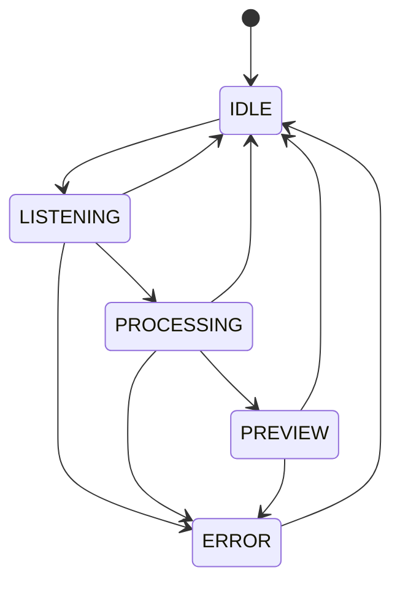

# InnerVoice


`InnerVoice` 是一个面向 Windows 桌面的语音输入原型。它的目标不是单纯“把语音识别成文本”，而是把“按下热键开始说话 -> 实时预览 -> 确认后注入到当前输入窗口”这条链路打通，形成一个可运行、可演示、可继续迭代的 MVP。

当前版本已经覆盖以下核心流程：

- 全局热键唤起
- 麦克风录音与流式语音识别
- 悬浮状态栏实时预览
- 最终文本确认/取消
- 恢复目标窗口焦点并注入文本

## Current Status

这是一个桌面原型，不是生产就绪产品。当前仓库更适合作为：

- 语音输入法交互链路验证
- Windows 桌面语音输入 MVP
- 后续离线 ASR、UI 打磨、打包发布的基础工程

## Features

- 默认长按 `Right Ctrl` 触发录音
- 使用 `PyAudio` 采集 16kHz 单声道 PCM 音频
- 使用讯飞 IAT WebSocket 进行流式语音识别
- 使用 `PySide6` 显示底部悬浮状态栏
- 实时显示中间识别结果和最终结果
- 识别完成后支持确认或取消
- 通过剪贴板 + `Ctrl+V` 将文本注入目标应用
- 注入前记录并恢复目标窗口焦点
- 为状态机、配置、热键、注入、ASR 关键逻辑提供单元测试

## Typical Flow

```text
Long press Right Ctrl
  -> start listening
  -> connect to iFlytek IAT
  -> stream microphone audio
  -> show partial transcript
Release Right Ctrl
  -> stop recording
  -> wait for final transcript
Preview final text
  -> Enter / click Confirm to inject
  -> Esc / click Cancel to abort
```

## Architecture


## State Flow



状态说明：

- `IDLE`：空闲状态，悬浮窗隐藏
- `LISTENING`：正在录音，显示实时识别结果
- `PROCESSING`：已停止录音，等待最终识别结果
- `PREVIEW`：展示最终文本，等待确认或取消
- `ERROR`：识别或设备异常，等待关闭并回到空闲状态

## Project Structure

```text
InnerVoice/
├─ assets/                  # 图标等静态资源
├─ configs/                 # 默认配置、共享配置、本地覆盖配置
├─ docs/                    # 设计文档与计划
├─ scripts/                 # 预留脚本目录
├─ src/
│  ├─ app/                  # 应用入口
│  ├─ core/config/          # 配置加载与深度合并
│  ├─ modules/
│  │  ├─ asr/               # 录音采集与讯飞 IAT 客户端
│  │  ├─ hotkey/            # 全局热键管理
│  │  ├─ injector/          # 文本注入
│  │  └─ overlay/           # 悬浮窗、状态机、状态指示
│  └─ shared/types/         # 共享枚举与类型
└─ tests/unit/              # 单元测试
```

## Tech Stack

- Python 3.10+
- PySide6
- PyAudio
- websocket-client
- keyboard
- pywin32
- pytest

## Requirements

运行环境要求：

- Windows 10 或更高版本
- Python 3.10 及以上
- 可用麦克风设备
- 讯飞开放平台 IAT 凭据

当前实现显式依赖 Windows 桌面环境，原因包括：

- `keyboard` 负责全局热键监听
- `pywin32` 负责前台窗口与剪贴板操作
- 文本注入流程依赖 Windows 输入焦点恢复

## Quick Start

### 1. Clone

```bash
git clone https://github.com/GodvFocus/InnerVoice.git
cd InnerVoice
```

### 2. Create a virtual environment

```bash
python -m venv .venv
.venv\Scripts\activate
```

### 3. Install dependencies

```bash
pip install -r requirements.txt
```

如果 `PyAudio` 安装失败，通常是本地音频依赖或 Python 版本兼容问题。这个项目更适合直接在 Windows 原生 Python 环境中运行。

### 4. Configure ASR credentials

编辑 [configs/settings.json](/D:/LearnPython/InnerVoice/configs/settings.json)，或更推荐新建 [configs/settings.local.json](/D:/LearnPython/InnerVoice/configs/settings.local.json)：

```json
{
  "asr": {
    "appid": "your-appid",
    "apikey": "your-apikey",
    "apisecret": "your-apisecret"
  }
}
```

推荐使用 `settings.local.json` 保存本机私有凭据，因为 `.gitignore` 已忽略 `*.local.json`。

### 5. Run

```bash
python src/app/main.py
```

## Default Controls

- 长按 `Right Ctrl`：开始录音
- 松开 `Right Ctrl`：结束录音并进入识别收尾
- `Enter`：在预览状态下确认注入
- `Esc`：取消当前流程
- 点击悬浮窗 `确认`：注入文本
- 点击悬浮窗 `取消`：取消流程

## Configuration

配置加载顺序如下：

```text
DEFAULTS
-> configs/default_settings.json
-> configs/settings.json
-> configs/settings.local.json
```

默认配置定义同时存在于 [configs/default_settings.json](/D:/LearnPython/InnerVoice/configs/default_settings.json) 和 [src/core/config/settings.py](/D:/LearnPython/InnerVoice/src/core/config/settings.py)：

| Key | Default | Current Status |
| --- | --- | --- |
| `hotkey` | `right ctrl` | 已接入 |
| `long_press_threshold_ms` | `300` | 已接入 |
| `panel_width` | `480` | 已定义，当前 UI 仍使用代码内常量 |
| `panel_height` | `42` | 已定义，当前 UI 仍使用代码内常量 |
| `panel_offset_y` | `60` | 已定义，当前 UI 仍使用代码内常量 |
| `font_size` | `13` | 已定义，当前 UI 仍使用代码内常量字体设置 |
| `idle_timeout_seconds` | `30` | 已定义，当前未看到实际接入 |
| `asr.appid` | `""` | 已接入 |
| `asr.apikey` | `""` | 已接入 |
| `asr.apisecret` | `""` | 已接入 |
| `asr.language` | `zh_cn` | 已定义，当前 IAT 客户端内仍写死为 `zh_cn` |
| `asr.accent` | `mandarin` | 已定义，当前 IAT 客户端内仍写死为 `mandarin` |

## Testing

运行单元测试：

```bash
pytest tests/unit -q
```

当前测试主要覆盖：

- `Settings`：配置加载与深度合并
- `StateMachine`：状态切换规则
- `HotkeyManager`：长按、释放、确认、取消逻辑
- `AudioCapture`：录音采集流程
- `IATClient`：签名、请求、结果拼接逻辑
- `TextInjector`：剪贴板保存/恢复与注入流程

## Key Entry Points

- [src/app/main.py](/D:/LearnPython/InnerVoice/src/app/main.py)
- [src/core/config/settings.py](/D:/LearnPython/InnerVoice/src/core/config/settings.py)
- [src/modules/asr/audio_capture.py](/D:/LearnPython/InnerVoice/src/modules/asr/audio_capture.py)
- [src/modules/asr/iat_client.py](/D:/LearnPython/InnerVoice/src/modules/asr/iat_client.py)
- [src/modules/hotkey/hotkey_manager.py](/D:/LearnPython/InnerVoice/src/modules/hotkey/hotkey_manager.py)
- [src/modules/injector/text_injector.py](/D:/LearnPython/InnerVoice/src/modules/injector/text_injector.py)
- [src/modules/overlay/overlay_window.py](/D:/LearnPython/InnerVoice/src/modules/overlay/overlay_window.py)

## Known Limitations

- 仅支持 Windows
- 依赖讯飞 IAT 在线服务
- 注入方式依赖剪贴板与 `Ctrl+V`，对特殊控件兼容性有限
- 一部分配置项已经定义，但尚未完整接入运行时 UI / ASR
- 尚未提供打包、安装器和发布流程
- 仓库内暂未放入正式演示 GIF 或截图

## Roadmap

- 将 UI 尺寸、偏移、字体等配置真正接入悬浮窗
- 将 `asr.language` 和 `asr.accent` 改为由配置驱动
- 补齐异常场景处理与恢复逻辑
- 改进文本注入兼容性
- 增加打包与发布方案
- 补充演示素材与使用截图

## FAQ

### 为什么现在是 Windows only？

因为热键监听、前台窗口恢复、剪贴板注入这几块都直接依赖 Windows 生态库和桌面行为模型。

### 为什么使用在线 ASR，而不是离线识别？

当前目标是尽快跑通“完整输入链路”。相比先做离线模型集成，在线 ASR 更适合快速验证桌面交互方案。

### 为什么有些配置项改了没有生效？

因为部分配置项虽然已经在设置层定义，但 UI 和 ASR 模块里仍有硬编码常量，README 已在配置表中标明这类字段的接入状态。

### 为什么文本注入使用剪贴板 + Ctrl+V？

这是当前版本里最直接、最稳定、最容易跨应用演示的方案。后续如果要增强兼容性，再考虑更底层的输入注入方式。

### `settings.json` 和 `settings.local.json` 用哪个？

- `settings.json` 适合项目内共享的非敏感配置
- `settings.local.json` 适合本机私有配置，比如 API 凭据

### 这个项目现在适合直接生产使用吗？

不适合。当前更准确的定位是桌面语音输入原型和演示级 MVP。

## Contributing

欢迎围绕这些方向继续完善：

- 依赖管理与打包
- UI / UX 优化
- ASR 稳定性与配置能力
- 自动化测试补充
- 文档、截图与演示素材

提交前建议至少执行：

```bash
pytest tests/unit -q
```

## License

本项目采用 MIT License，详见 [LICENSE](/D:/LearnPython/InnerVoice/LICENSE)。
