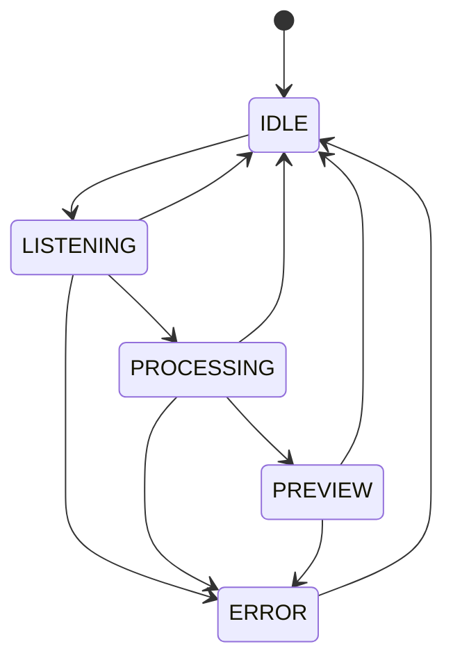

# InnerVoice


InnerVoice 是一个面向 Windows 桌面的语音输入应用。它把“按住热键说话、实时看到转写、确认后回填到当前输入框”这一整条交互链路真正打通，让语音输入不只停留在识别结果展示，而是可以直接融入日常写作、聊天、搜索和办公输入场景。

项目当前已经具备完整的桌面输入闭环：全局热键唤起、麦克风采集、流式语音识别、悬浮态预览、确认/取消、恢复目标窗口焦点并注入文本。对于希望构建语音输入法、桌面语音助手或多模态输入前端的开发者来说，InnerVoice 提供了一个结构清晰、模块边界明确、便于继续演进的基础工程。

## Why InnerVoice

- 真正可用的输入闭环：不是单独的 ASR Demo，而是从语音采集到文本落入目标应用的完整桌面交互流程。
- 面向桌面效率场景：全局热键触发，不打断当前工作流，适合聊天框、搜索框、文档编辑器等高频输入位置。
- 实时反馈明确：悬浮面板持续显示当前状态与中间转写结果，降低“说了但系统没反应”的不确定感。
- 工程拆分清楚：热键、ASR、悬浮 UI、状态机、文本注入、配置系统彼此解耦，适合扩展离线识别、替换识别引擎或升级前端表现。
- 已有单元测试基础：核心状态流转、配置合并、热键行为、音频采集、识别结果拼接、文本注入都具备测试覆盖。

## Core Experience

默认交互如下：

```text
Long press Right Ctrl
  -> start listening
  -> connect to iFlytek IAT
  -> stream microphone audio
  -> show partial transcript
Release Right Ctrl
  -> stop recording
  -> wait for final transcript
Preview final text
  -> Enter / click Confirm to inject
  -> Esc / click Cancel to abort
```

这套交互兼顾了两件事：

- 足够快：长按即说，松开即收尾，不需要打开独立窗口。
- 足够稳：文本不会直接强行注入，而是先进入预览态，允许用户确认或取消。

## Feature Highlights

- 全局热键触发语音输入，默认使用 `Right Ctrl`
- 长按阈值可配置，避免误触
- 使用 `PyAudio` 采集 16kHz、单声道、16-bit PCM 音频
- 接入讯飞 IAT WebSocket 流式识别
- 支持中间结果实时刷新与最终结果收敛
- 悬浮面板常驻顶层显示，反馈录音中、识别中、预览完成、错误等状态
- 提供确认与取消动作，兼顾速度与可控性
- 注入前记录当前前台窗口，确认时恢复焦点后执行文本粘贴
- 自动保存并恢复剪贴板内容，尽量减少对用户当前环境的干扰
- 通过状态机统一管理整个交互流程，降低异步链路复杂度

## UI Preview Logic

悬浮面板位于屏幕底部居中位置，采用轻量级无边框设计，重点展示状态而不是抢占界面。面板中包含：

- 状态指示灯
- 当前阶段标签
- 实时转写文本
- 确认/取消按钮

不同状态下会切换不同视觉反馈：

- `LISTENING`：呼吸效果，表示正在录音
- `PROCESSING`：轻脉冲效果，表示正在等待最终识别结果
- `PREVIEW`：显示确认/取消操作
- `ERROR`：快速闪烁，提示异常状态

## Architecture


## State Flow



状态说明：

- `IDLE`：空闲状态，面板隐藏
- `LISTENING`：已进入录音阶段，持续发送音频并显示中间结果
- `PROCESSING`：录音结束，等待识别服务返回最终文本
- `PREVIEW`：展示最终文本，等待用户确认或取消
- `ERROR`：设备或识别异常，等待用户关闭并回到空闲态

## Project Structure

```text
InnerVoice/
├─ assets/                     # 图标等静态资源
├─ configs/                    # 默认配置、共享配置、本地覆盖配置
├─ docs/                       # 设计文档与实现计划
├─ scripts/                    # 预留脚本目录
├─ src/
│  ├─ app/                     # 应用入口与启动编排
│  ├─ core/config/             # 配置加载与深度合并
│  ├─ modules/
│  │  ├─ asr/                  # 音频采集与讯飞 IAT 客户端
│  │  ├─ hotkey/               # 全局热键管理
│  │  ├─ injector/             # 文本注入与焦点恢复
│  │  └─ overlay/              # 悬浮窗口、状态指示、状态机
│  └─ shared/types/            # 共享枚举与类型
└─ tests/unit/                 # 单元测试
```

## Tech Stack

- Python 3.10+
- PySide6
- PyAudio
- websocket-client
- keyboard
- pywin32
- pytest

## Requirements

运行环境要求：

- Windows 10 或更高版本
- Python 3.10 及以上
- 可用麦克风设备
- 讯飞开放平台 IAT 凭据

当前实现依赖 Windows 桌面能力，主要包括：

- `keyboard`：全局热键监听
- `pywin32`：前台窗口获取、窗口激活、剪贴板读写
- `Ctrl+V` 文本注入链路：依赖目标应用可接受标准粘贴操作

## Quick Start

### 1. Clone

```bash
git clone https://github.com/GodvFocus/InnerVoice.git
cd InnerVoice
```

### 2. Create a virtual environment

```bash
python -m venv .venv
.venv\Scripts\activate
```

### 3. Install dependencies

```bash
pip install -r requirements.txt
```

如果 `PyAudio` 安装失败，通常与本地音频依赖或 Python 环境兼容性有关。建议直接在原生 Windows Python 环境中运行。

### 4. Configure ASR credentials

编辑 [configs/settings.json](/D:/LearnPython/InnerVoice/configs/settings.json)，或更推荐新建 [configs/settings.local.json](/D:/LearnPython/InnerVoice/configs/settings.local.json)：

```json
{
  "asr": {
    "appid": "your-appid",
    "apikey": "your-apikey",
    "apisecret": "your-apisecret"
  }
}
```

推荐将本机私有凭据放在 `settings.local.json` 中。仓库已忽略 `*.local.json`。

### 5. Run

```bash
python src/app/main.py
```

应用启动后，长按 `Right Ctrl` 即可开始说话。

## Default Controls

- 长按 `Right Ctrl`：开始录音
- 松开 `Right Ctrl`：结束录音并进入识别收尾阶段
- `Enter`：在预览状态下确认注入
- `Esc`：取消当前流程
- 点击悬浮窗“确认”：注入文本
- 点击悬浮窗“取消”：取消流程

## Configuration

配置加载顺序如下：

```text
DEFAULTS
-> configs/default_settings.json
-> configs/settings.json
-> configs/settings.local.json
```

当前已定义的核心配置包括：

| Key | Default | Description |
| --- | --- | --- |
| `hotkey` | `right ctrl` | 触发语音输入的热键 |
| `long_press_threshold_ms` | `300` | 长按触发阈值 |
| `panel_width` | `480` | 面板宽度 |
| `panel_height` | `42` | 面板高度 |
| `panel_offset_y` | `60` | 面板距屏幕底部偏移 |
| `font_size` | `13` | 文字字号预留配置 |
| `idle_timeout_seconds` | `30` | 空闲超时预留配置 |
| `asr.appid` | `""` | 讯飞应用 ID |
| `asr.apikey` | `""` | 讯飞 API Key |
| `asr.apisecret` | `""` | 讯飞 API Secret |
| `asr.language` | `zh_cn` | 识别语言配置 |
| `asr.accent` | `mandarin` | 方言/口音配置 |

说明：

- 配置系统已经支持深度合并与本地覆盖。
- 部分 UI 与 ASR 参数已经在配置层定义，但当前运行时仍有少量模块使用代码内常量，后续可以继续接入。

## Quality and Testing

运行测试：

```bash
pytest tests/unit -q
```

当前单元测试主要覆盖：

- `Settings`：默认值、文件加载、深度合并、本地保存
- `StateMachine`：合法/非法状态转换
- `HotkeyManager`：长按检测、释放收尾、确认/取消逻辑
- `AudioCapture`：录音启动、停止、音频块发射、设备异常
- `IATClient`：鉴权请求构造、流式结果拼接、结束帧发送、错误处理
- `TextInjector`：剪贴板保存恢复、粘贴注入、异常容错

## Key Entry Points

- [src/app/main.py](/D:/LearnPython/InnerVoice/src/app/main.py)
- [src/core/config/settings.py](/D:/LearnPython/InnerVoice/src/core/config/settings.py)
- [src/modules/asr/audio_capture.py](/D:/LearnPython/InnerVoice/src/modules/asr/audio_capture.py)
- [src/modules/asr/iat_client.py](/D:/LearnPython/InnerVoice/src/modules/asr/iat_client.py)
- [src/modules/hotkey/hotkey_manager.py](/D:/LearnPython/InnerVoice/src/modules/hotkey/hotkey_manager.py)
- [src/modules/injector/text_injector.py](/D:/LearnPython/InnerVoice/src/modules/injector/text_injector.py)
- [src/modules/overlay/overlay_window.py](/D:/LearnPython/InnerVoice/src/modules/overlay/overlay_window.py)

## Current Boundaries

为了让 README 与当前代码保持一致，下面这些边界需要明确说明：

- 当前仅支持 Windows
- 当前识别链路依赖讯飞 IAT 在线服务
- 文本注入基于剪贴板与 `Ctrl+V`，对少数自绘控件或受限应用可能存在兼容性差异
- 一部分配置项已存在，但尚未完全接入所有运行时模块

这些边界并不影响项目作为桌面语音输入基础工程的完整性，反而清晰地展示了它已经具备的工程框架与可扩展空间。

## Suitable Use Cases

- 桌面语音输入法原型与产品验证
- Windows 语音助手前端
- 面向中文输入场景的办公效率工具
- 需要“全局热键 + 语音转写 + 文本回填”闭环的桌面应用
- 作为离线 ASR、LLM 重写、命令解析等后续能力的输入前端

## Roadmap

- 将更多面板尺寸、位置、字体配置接入实际 UI
- 将 `asr.language` 与 `asr.accent` 改为完全由配置驱动
- 优化特殊应用中的文本注入兼容性
- 增强异常恢复与稳定性处理
- 补充安装、打包与发布流程
- 增加演示素材与界面截图

## Contributing

欢迎围绕这些方向继续完善：

- 桌面交互与 UI/UX 体验
- ASR 可插拔架构与离线识别支持
- 文本注入兼容性与稳定性
- 自动化测试补充
- 打包、安装与发布工程化

提交前建议至少执行：

```bash
pytest tests/unit -q
```

## License

本项目采用 [MIT License](/D:/LearnPython/InnerVoice/LICENSE)。
